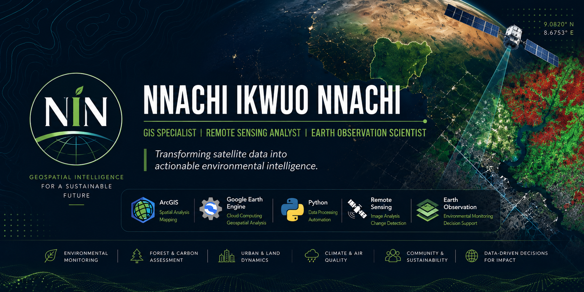

  

<h1 align="center">🌍 Nnachi Ikwuo Nnachi</h1>
<h3 align="center">GIS Specialist • Remote Sensing Analyst • Earth Observation Scientist</h3>

  <i>Transforming Earth Observation into actionable environmental intelligence.</i>

  
  
  
  

  

---

# 👋 About Me

I am a **GIS Specialist**, **Remote Sensing Analyst**, and **Earth Observation Scientist** with over five years of professional experience applying geospatial technologies to environmental monitoring, climate analytics, forest assessment, urban dynamics, and sustainable resource management.

My work integrates Geographic Information Systems (GIS), satellite remote sensing, cloud-based geospatial computing, and spatial data science to produce reproducible workflows, interactive dashboards, and decision-support tools for research and policy.

---

# 🏆 Professional Highlights
- 🌍 Author and co-author of peer-reviewed publications
- 🛰 Large-scale geospatial analysis using Google Earth Engine
- 🌳 National forest carbon and land-cover assessments
- 🔥 Research focus: Urban Heat, Climate Analytics, Forest Monitoring & Air Quality
- 🎓 Lecturer in GIS, Remote Sensing, Cartography and Spatial Analysis
- 🌐 Building open-source geospatial tools and dashboards

---

# 🛰 Technical Expertise

### 🗺 GIS & Mapping

### 🛰 Earth Observation & Datasets

### 💻 Programming & Tools

### 🌍 Research Areas
- **Remote Sensing**
- **Earth Observation**
- **Climate Analytics**
- **Forest Carbon**
- **Urban Heat**
- **Air Quality**
- **LULC Mapping**
- **GeoAI**
- **Spatial Modelling**

---

# 🔭 Current Focus
- 🇳🇬 Nigeria Climate Dashboard
- 🌡 Urban Heat Dynamics of Enugu State
- 🌳 National Forest Carbon Assessment
- 🌫 PM₂.₅ & PM₁₀ Spatial Modelling
- 🛰 Geospatial AI Applications

---

# 📚 Selected Publications
- **Urban Expansion and Landscape Transformation in Lokoja Metropolis** *(Biosphere, 2026)*
- **Forest Cover Dynamics and Socio-Ecological Drivers in Okwangwo** *(Journal of Sustainable Forestry, 2026)*
- **Integrating Traditional Ecological Knowledge into Forest Governance** *(Environmental Policy and Governance, 2026)*
- **Geospatial Assessment of Forest Carbon Dynamics in Nigeria** *(Kaduna Journal of Geography, 2025)*

---

# 🚀 Featured Projects
- 🇳🇬 Nigeria Climate Dashboard *(In Development)*
- 🌳 National Forest Carbon Assessment
- 🔥 Urban Heat Dynamics of Enugu
- 🌲 Okwangwo Forest Change Analysis
- 🌫 Air Quality Modelling

---

# 📊 GitHub Statistics

---

# 🌐 Connect With Me
- 📧 **Email:** [nnachiikwuo@gmail.com](mailto:nnachiikwuo@gmail.com)
- 💼 **LinkedIn:** [Profile](https://www.linkedin.com/in/nnachi-nnachi-016390114/)
- 🎓 **Google Scholar:** [Profile](https://scholar.google.com/citations?user=aV0_MHkAAAAJ&hl=en)
- 🆔 **ORCID:** [0000-0002-3455-3450](https://orcid.org/0000-0002-3455-3450)

---

  <b>Transforming Earth Observation into actionable environmental intelligence.</b>

